<p align="center">
  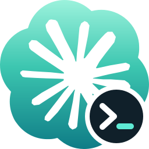
</p>

<h1 align="center">Remote Control Conductor</h1>

<p align="center">
  <b>Keep Claude Code running on your servers, and work with it from anywhere.</b><br>
  A Mac app and a small Linux server for Claude Code CLI sessions with Remote Control,<br>
  across your projects and your personal, work and client accounts.
</p>

<p align="center">
  <a href="https://github.com/marcusadolfsson/remote-control-conductor/releases/latest"><b>Download for macOS</b></a>
  &nbsp;·&nbsp;
  <a href="#getting-started">Getting started</a>
  &nbsp;·&nbsp;
  <a href="#let-claude-do-it">MCP server</a>
</p>

<p align="center">
  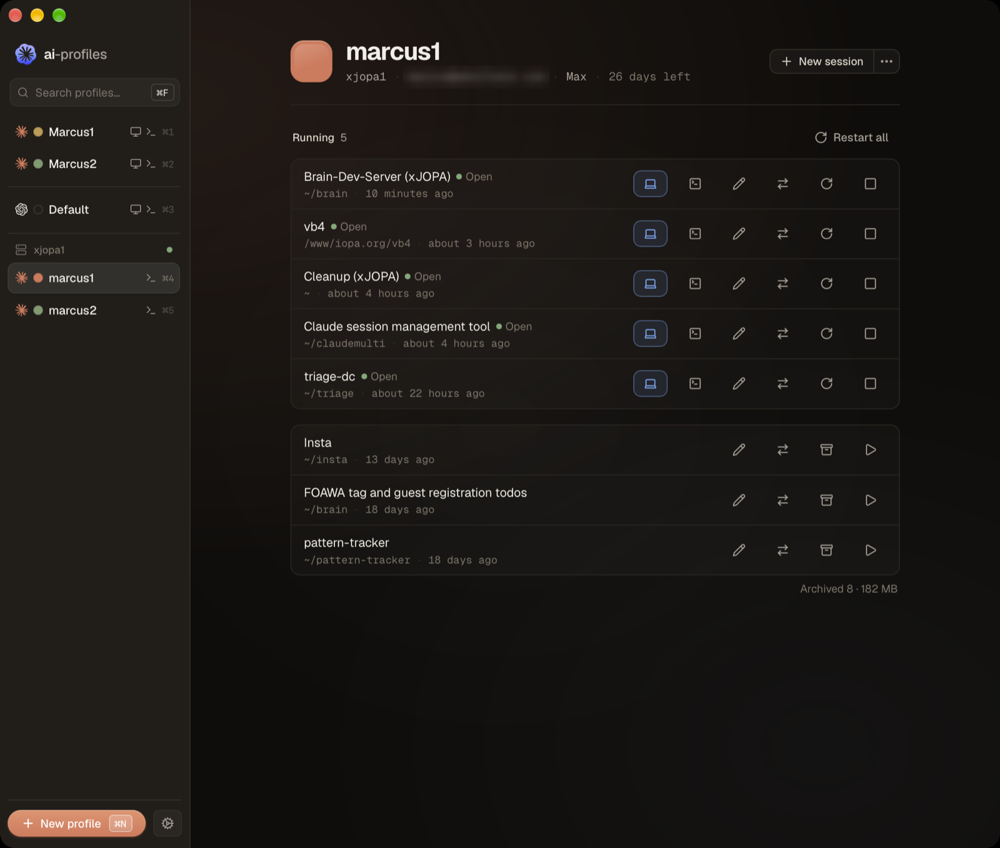
</p>

## Why

I run Claude Code on a few Linux machines: a VM in the cloud, a box at the office, a container on my
NAS. With Remote Control I can pick those sessions up from the Claude app on my phone or my Mac, which is
wonderful. But someone still has to start them, keep them alive, restart them when Claude Code updates,
and keep track of which account each one runs under. That someone was me, in a lot of ssh sessions.

Remote Control Conductor does that part. A small server runs on each Linux machine, and the Mac app talks
to all of them, so every session on every server is in one sidebar. You start, stop and restart them from
there, and work in them wherever you like, through Claude's own apps.

It's for Claude Code CLI on servers. Remote Control between Claude Desktop installs already works well on
its own.

## How it's organised

It's built for working on several projects with different Claude accounts: a personal account, a work
account, an account for a particular client or project.

On your Mac, each of your Claude accounts gets a **desktop profile**, its own Claude app. That's where a
server session on that account opens when you click *Open in Claude*. Claude on iOS natively supports multiple 
accounts.

On a server, each **profile** gets its own Claude Code folder, with its own sessions, memory
and sign-in. Mine are called things like `brain`, `foawa` and `home-assistant`. Several profiles can share one account.

To move a profile to a different Claude account, say from personal to work, you don't move anything. You
**switch the profiles's account**: its sessions stop, it signs in as the other account, and the same
sessions come back in the same conversations, with Remote Control on. Your other profiles don't notice.
Signing out and in is something Claude Code supports, so this doesn't depend on how it happens to store
its files.

## What it's like to use

**Starting a session.** Pick a profile, click *New session*, choose a folder on the server, and it starts
in its own tmux window with Remote Control already on. It shows up in the Claude app on your phone a few
seconds later. If the server reboots, the sessions that were running come back by themselves.

<table>
  <tr>
    <td width="50%">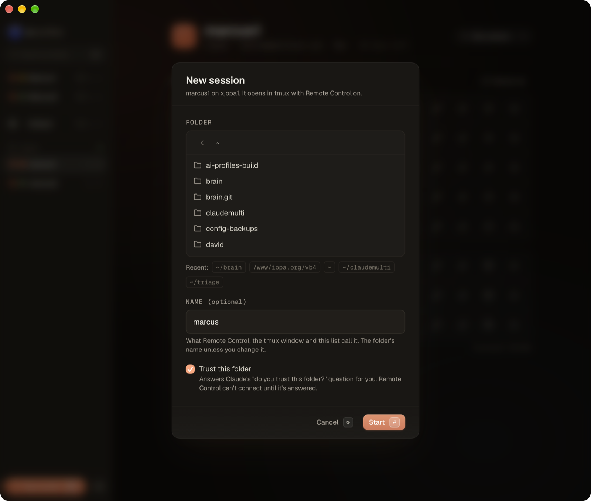<br><sub>A new session: a folder on the server, and a name if you like.</sub></td>
    <td width="50%">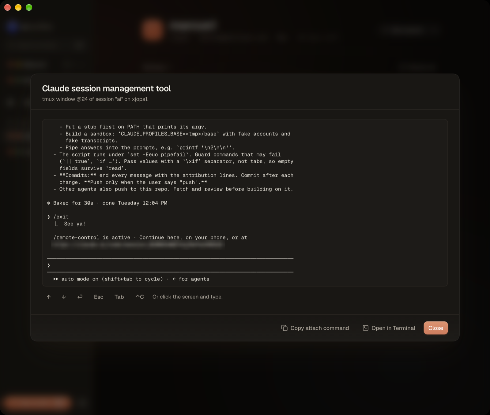<br><sub>A session that didn't start cleanly: its tmux window, live in the app.</sub></td>
  </tr>
</table>

**Picking it up anywhere.** The *Remote Control* entry in the sidebar lists every session that's
connected right now, on all your servers, grouped by account. One click opens a session in the Claude
app for that account on your Mac, and it's already on your phone. Each desktop profile shows the
sessions on its own account too.

<table>
  <tr>
    <td width="50%">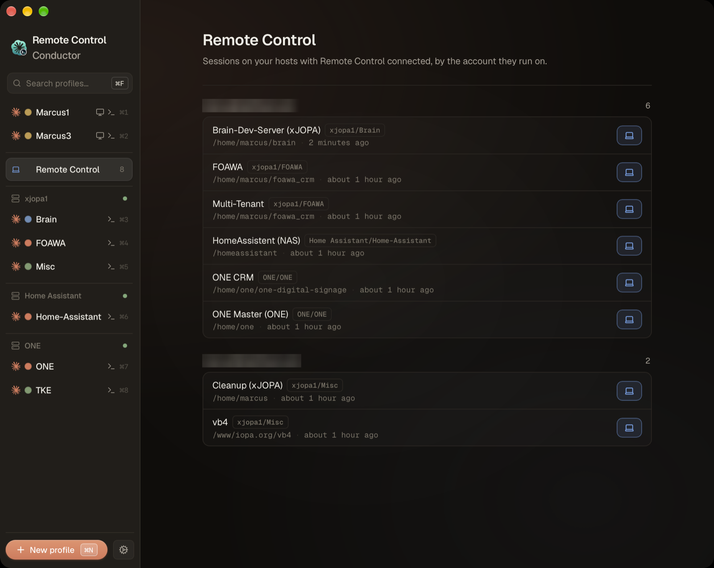<br><sub>Everything that's connected, by account.</sub></td>
    <td width="50%">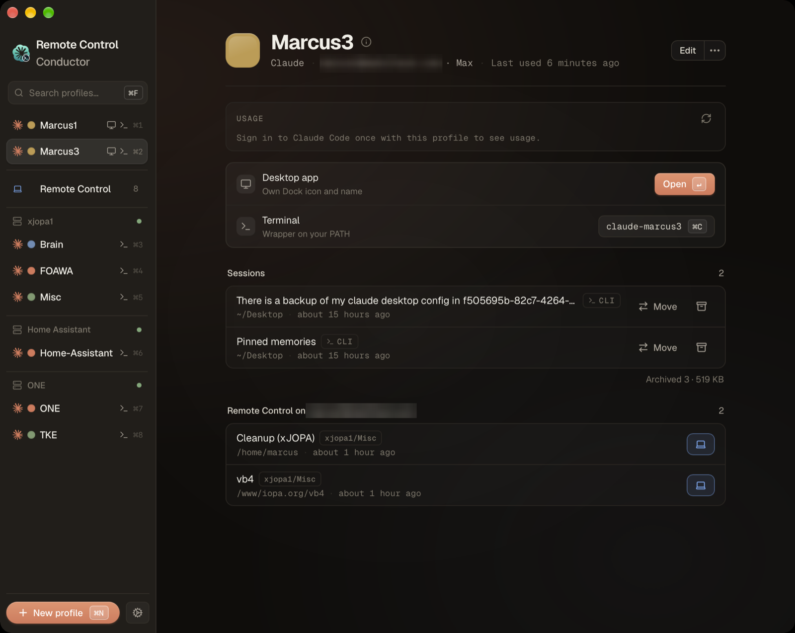<br><sub>A desktop profile, with the sessions on its account.</sub></td>
  </tr>
</table>

**Signing in.** Adding a profile to a server, or switching its account, opens Claude's usual sign-in
page in your Mac's browser. You sign in there and paste the code back into the app. No ssh, no browser on
the server, no copying long links out of a terminal.

**Changing a profiles's account.** *Switch account…* on the profile stops its sessions, signs it in as
the other account, and resumes them. If your browser was still signed in to the old account, the app notices
and tells you, rather than quietly switching you to the same one.

<p align="center">
  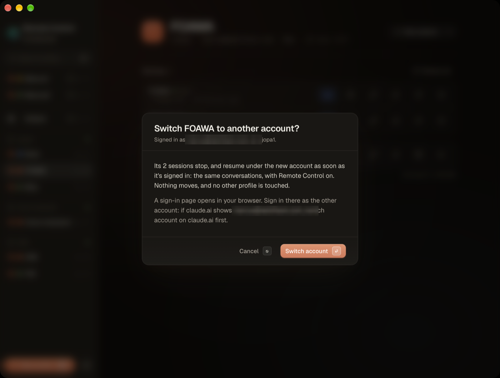
</p>

**When Claude Code updates.** It updates itself on the server, but a running session keeps the old
version until it restarts. The app marks those sessions in amber, and *Restart all* brings them back on
the new version, in the same conversations.

<p align="center">
  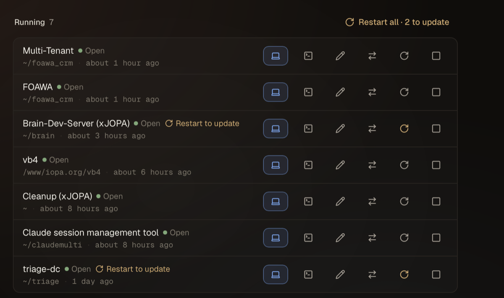
</p>

**When something's stuck.** Sometimes a session stops at a question before it gets going. You can see
its tmux window right in the app and answer it there, or open it in Terminal over ssh.

**Splitting a profile up.** You can also move a session to another profile on the same server, from the
session's ⋯ menu. The transcript, subagents, file history and plans go with it, and project memory is
merged, with you deciding about notes both sides changed. Claude Code doesn't officially support moving
sessions, so this works with its files as they're laid out today, with backups along the way. To change
the account a whole profile uses, switching is the better choice.

<table>
  <tr>
    <td width="50%">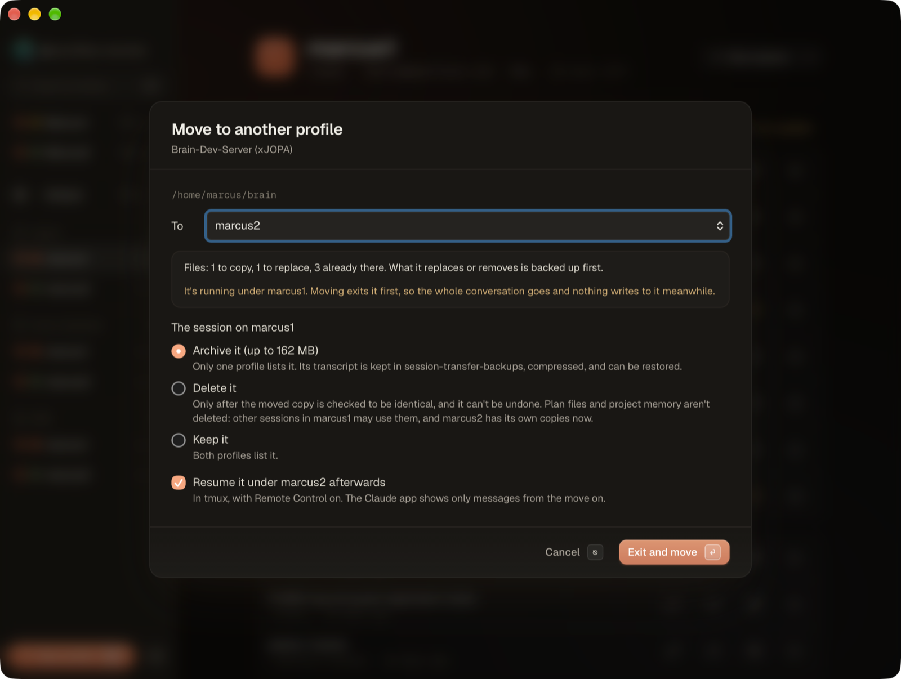<br><sub>Moving a session: it stops first, and anything replaced is backed up.</sub></td>
    <td width="50%">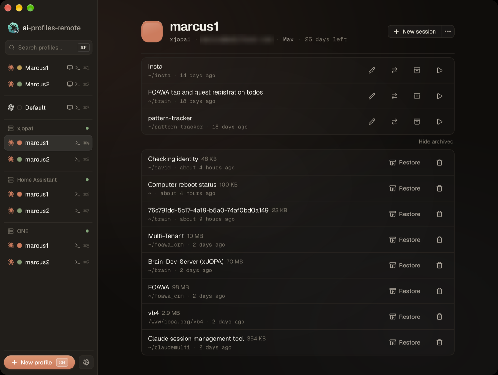<br><sub>Old sessions can be archived, compressed, and restored later.</sub></td>
  </tr>
</table>

## Let Claude do it

The app is also an MCP server, so you can ask Claude Desktop or Claude Code to do any of this: *"restart
everything on xjopa1 that's waiting on an update"*, *"what's the brain session stuck on?"*, *"switch foawa
to my work account"*. Claude starts the server itself when it needs it, so the app doesn't even have to be
open.

To set it up, go to **Settings → MCP server** and click *Add to my Claude profiles*. Or add it by hand:

```sh
claude mcp add --scope user remote-control-conductor -- '/Applications/Remote Control Conductor.app/Contents/MacOS/remote-control-conductor' mcp
```

## Getting started

You'll need a Mac, and one or more Linux machines (x86_64 or arm64) with tmux 3.0 or newer and Claude
Code. The Mac and the servers have to be on the same Tailnet, WireGuard VPN or LAN. The server isn't
meant to face the internet, and by default it only answers Tailscale, WireGuard and the machine itself.

**1. Install the app.** Download the `.dmg` from
[Releases](https://github.com/marcusadolfsson/remote-control-conductor/releases/latest) and drag
*Remote Control Conductor* to Applications. It's signed and notarized.

**2. Install the server** on each Linux machine:

```sh
sudo apt install tmux
curl -fsSL https://claude.ai/install.sh | bash
mkdir -p ~/.local/bin && curl -fsSL https://github.com/marcusadolfsson/remote-control-conductor/releases/latest/download/remote-control-conductor-server-$(uname -m)-linux -o ~/.local/bin/remote-control-conductor-server && chmod +x ~/.local/bin/remote-control-conductor-server
remote-control-conductor-server setup
```

`setup` checks tmux and Claude Code, asks which networks may connect, installs itself as a service that
survives reboots, and ends with a pairing code.

**3. Pair.** In the app, open **Settings → Remote hosts → Pair a host** and paste the code. The same steps
are in the app under *How to set up a host*.

<p align="center">
  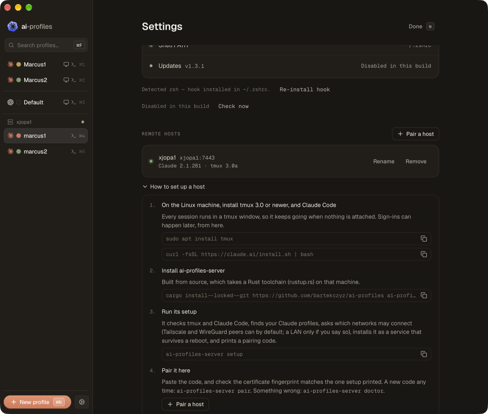
</p>

Later on, `remote-control-conductor-server doctor` checks an install, `pair` makes a new code, and
`revoke` cuts a Mac off. The app doesn't update itself; new versions are on the Releases page.

## Security

The server speaks HTTPS with its own certificate, and the pairing code carries that certificate's
fingerprint, so your Mac trusts that server and nothing else. A pairing code works once, for ten minutes.
The token it's exchanged for stays in your Keychain, and the server only keeps a hash of it. Connections
from addresses you haven't allowed are dropped before they get anywhere, and failed attempts are
rate-limited. On the server, `claude` and tmux are always started directly, never through a shell, and the
app only types into windows the server opened itself.

## How it compares

There are good tools near this. Account switchers like
[clauth](https://github.com/uwuclxdy/clauth) and
[ClaudeCodeMultiAccounts](https://github.com/Leuconoe/ClaudeCodeMultiAccounts) change which account a
terminal uses, but they don't know about sessions. Session managers like
[happy](https://github.com/slopus/happy), [Claude Code UI](https://github.com/siteboon/claudecodeui),
[claude-squad](https://github.com/smtg-ai/claude-squad), [ccmanager](https://github.com/kbwo/ccmanager),
[hive](https://github.com/latagore/hive) and [remy](https://github.com/padamchopra/remy) run or mirror
sessions, mostly for one account and through a client of their own.

Remote Control Conductor sits between them: every server, project and account in one place, accounts you
can switch without losing a session, and no new client to learn, because you keep working in Claude's own
apps.

## Built on ai-profiles

This started as a fork of [ai-profiles](https://github.com/bartekczyz/ai-profiles) by Bartek Czyż, the
macOS app for running several Claude accounts side by side, and it still does everything ai-profiles does.
Like ai-profiles, it's MIT-licensed and keeps its copyright notice (see [LICENSE](LICENSE)).

The changes on the Mac side are proposed upstream, one pull request each:

| PR | What it adds | Status |
|---|---|---|
| [#47](https://github.com/bartekczyz/ai-profiles/pull/47) | Security hardening | merged |
| [#48](https://github.com/bartekczyz/ai-profiles/pull/48) | Each Claude Desktop profile gets its own Claude Code config | merged |
| [#49](https://github.com/bartekczyz/ai-profiles/pull/49) | The default profile can be renamed | merged |
| [#50](https://github.com/bartekczyz/ai-profiles/pull/50) | Sessions: list, move, archive, restore | open |
| [#51](https://github.com/bartekczyz/ai-profiles/pull/51) | A color and ⌘1 for the default profile | open |
| [#52](https://github.com/bartekczyz/ai-profiles/pull/52) | A wrapper is named after its profile in the menu bar | open |
| [#53](https://github.com/bartekczyz/ai-profiles/pull/53) | The account a profile is signed in under | open |

<details>
<summary><b>Something worth knowing about the Claude desktop app</b></summary>

If the desktop app can't find the transcript one of its session records points to, it doesn't drop the
record. It quietly starts a new, empty session under it. That's how a session seems to "disappear" after a
profile's launcher is rebuilt: the record stays, but the history doesn't. When this app moves a session,
it moves the record together with the transcript, so that can't happen here.
</details>

## Building from source

```sh
git clone https://github.com/marcusadolfsson/remote-control-conductor.git
cd remote-control-conductor
pnpm install
pnpm --filter ai-profiles tauri build
```

The `.app` ends up in `apps/ai-profiles/src-tauri/target/release/bundle/macos/`, with the `.dmg` next to it
in `dmg/`. A local build isn't notarized, so macOS asks the first time you open it: right-click the app,
then Open.

To build the Linux server from a Mac, run
`cargo zigbuild --release -p remote-control-conductor-server --target x86_64-unknown-linux-musl` in
`apps/ai-profiles/src-tauri`, or `cargo install --locked --git https://github.com/marcusadolfsson/remote-control-conductor remote-control-conductor-server`
on the server itself.

To run the tests, use `cargo test` and `cargo clippy --all-targets -- -D warnings` in
`apps/ai-profiles/src-tauri`, and `pnpm test` in `apps/ai-profiles`. On Node 25 and later, vitest needs
`NODE_OPTIONS=--no-experimental-webstorage`. One test, *"shows the authoritative Codex reset count 2"*,
fails on upstream's `main` too.
